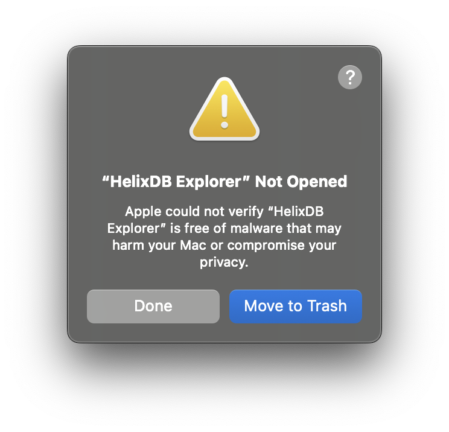
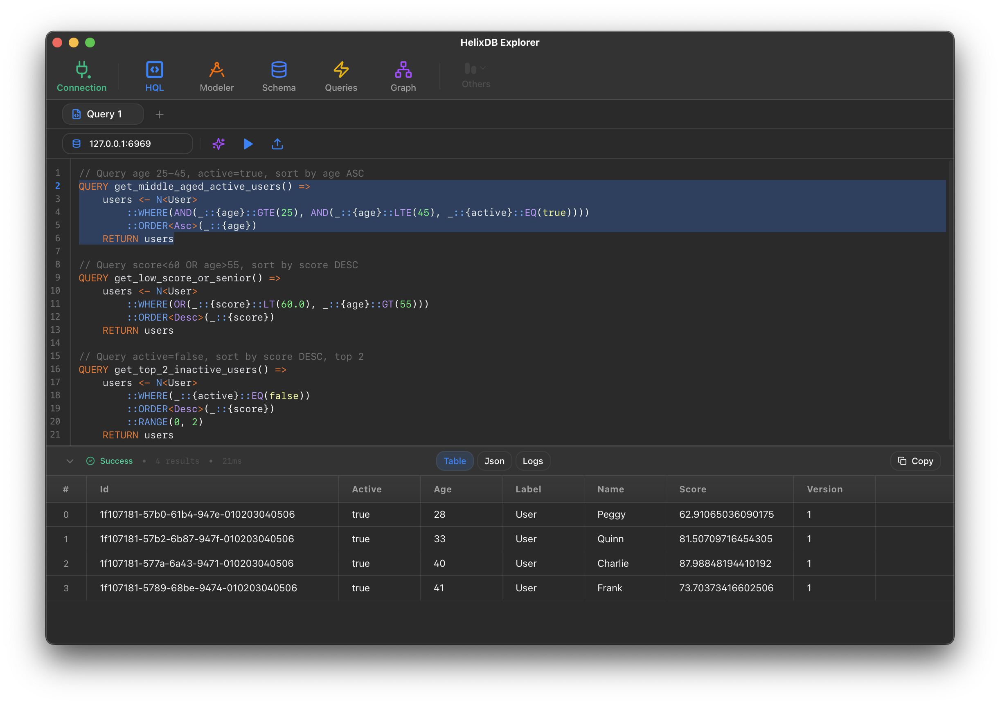
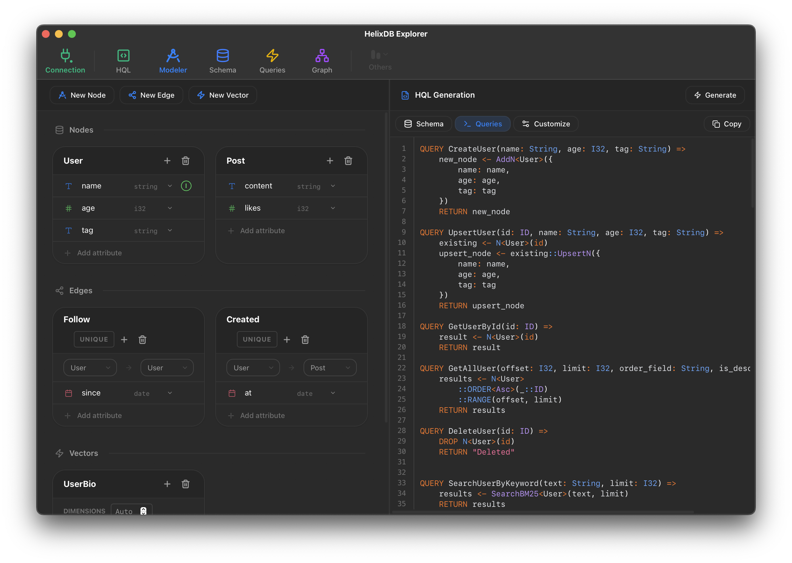
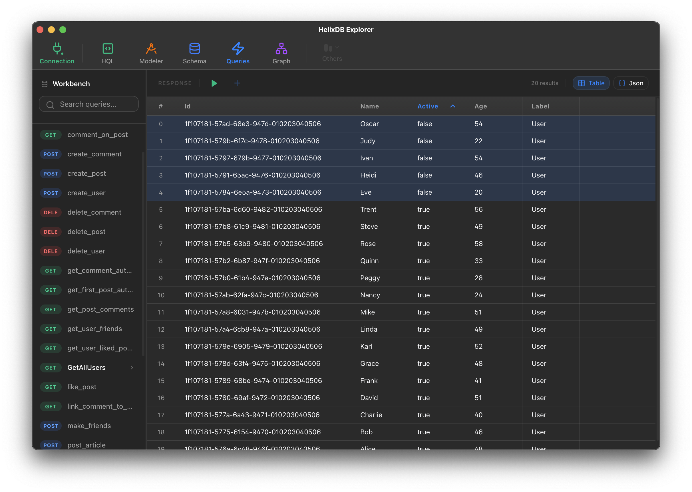
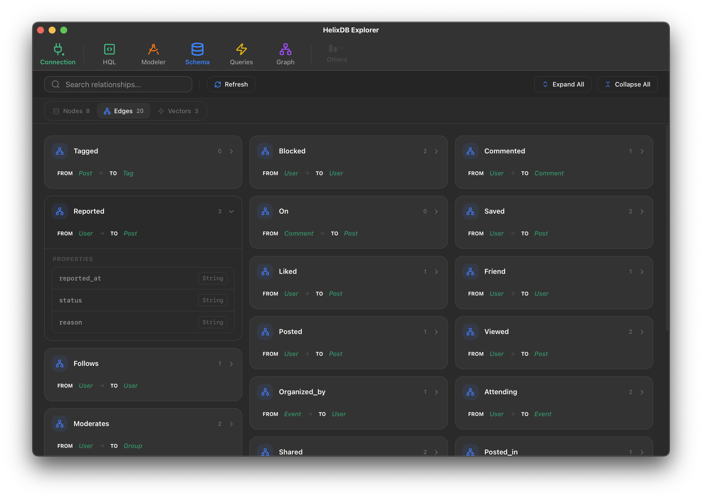
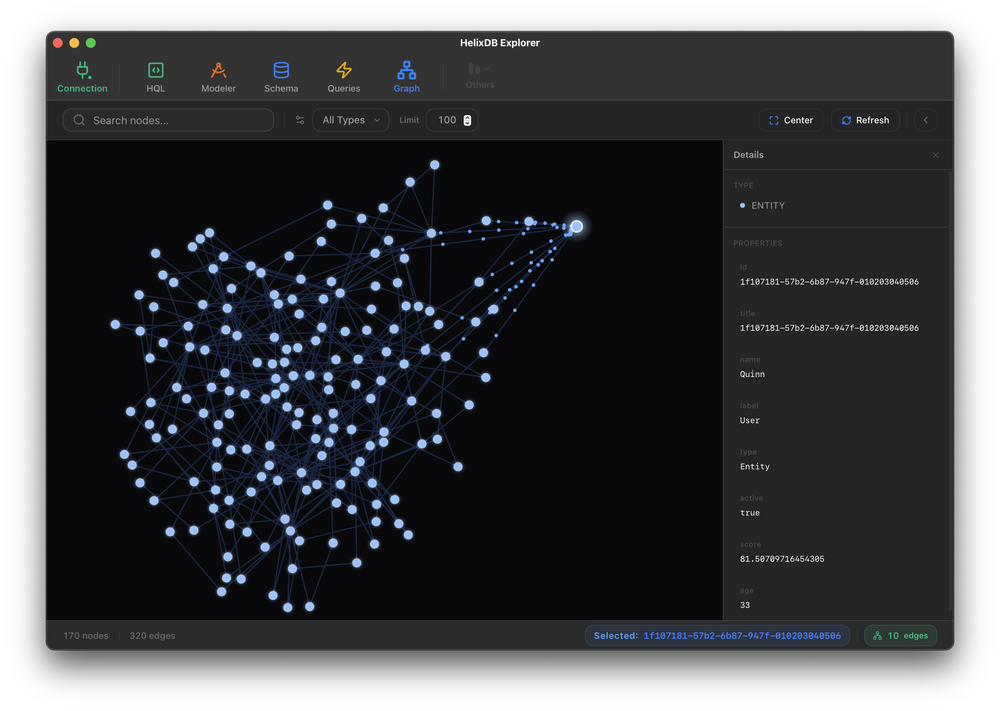

<div align="center">
  
  <h1>HelixDB Explorer</h1>
  <p>
    A GUI Tool for <strong>HelixDB</strong>.<br/>
    Intelligent HQL editor, graph visualization, and schema management for macOS, built with Tauri.
  </p>

  <p>
    <a href="https://nodfans.github.io/helixdb-explorer"><strong>🌐 Visit Official Website</strong></a>
    ·
    <a href="https://github.com/nodfans/helixdb-explorer/releases/latest/download/HelixDB-Explorer-macOS.dmg"><strong>📥 Download for macOS</strong></a>
    ·
    <a href="https://github.com/nodfans/helixdb-explorer/issues">🐞 Report Bug</a>
  </p>

    
    
    

</div>

## 📦 Installation

### Option 1: One-liner Install (Recommended)

The easiest way to install HelixDB Explorer and automatically bypass macOS Gatekeeper warnings is to use our terminal installer:

```bash
/bin/bash -c "$(curl -fsSL https://raw.githubusercontent.com/nodfans/helixdb-explorer/main/scripts/install.sh)"
```

### Option 2: Manual Download

[**📥 Download latest HelixDB Explorer for macOS**](https://github.com/nodfans/helixdb-explorer/releases/latest/download/HelixDB-Explorer-macOS.dmg)

> [!IMPORTANT]
> **"App is damaged" or "Cannot be opened" Error**: Since this app is not signed by a registered Apple Developer yet (Ad-hoc signed), macOS may block it on first launch.
>
> <div align="center">
>   
> </div>
>
> To fix this, run this command in your terminal:
>
> ```bash
> xattr -cr "/Applications/HelixDB Explorer.app"
> ```

## ✨ Features

### 🧠 Intelligent Editor

Write HQL queries faster with syntax highlighting, schema-aware autocomplete, and real-time error checking. The editor understands your graph structure and suggests valid traversals as you type.

<div align="center">
  
</div>

### 🧩 Visual Query Modeler

Build complex HQL queries without writing code. Use a block-based interface to define traversals, filters, and projections visually.

<div align="center">
  
</div>

### 🛠️ Production Workbench

Manage multiple connections (Local, Staging, Prod) and maintain a library of common queries. Seamlessly switch between **Table View** and **JSON View** for deep data inspection.

<div align="center">
  
</div>

### 📐 Schema Manager

Visualize and understand your graph structure at a glance. Inspect node types, edge definitions, and property constraints in a clean, card-based interface.

<div align="center">
  
</div>

### 🕸️ Graph Visualization

Interact with your data using high-performance node-link diagrams. Explore clusters, trace paths, and inspect properties visually.

<div align="center">
  
</div>

### Build from Source

Requirements:

- Node.js (v18+)
- Rust (stable)
- pnpm

```bash
# Clone the repository
git clone https://github.com/nodfans/helixdb-explorer.git
cd helixdb-explorer

# Install dependencies
pnpm install

# Run in development mode
pnpm tauri dev

# Build production binary
pnpm tauri build
```

## 🛠️ Tech Stack

- **Core**: [Rust](https://www.rust-lang.org/) (Tauri 2 Backend)
- **Frontend**: [SolidJS](https://www.solidjs.com/) + TypeScript
- **Protocol**: [MCP](https://modelcontextprotocol.io/) (Model Context Protocol)
- **Styling**: Vanilla CSS (Custom Design System)

## 📄 License

MIT © [HelixDB Explorer Team](https://github.com/nodfans)
